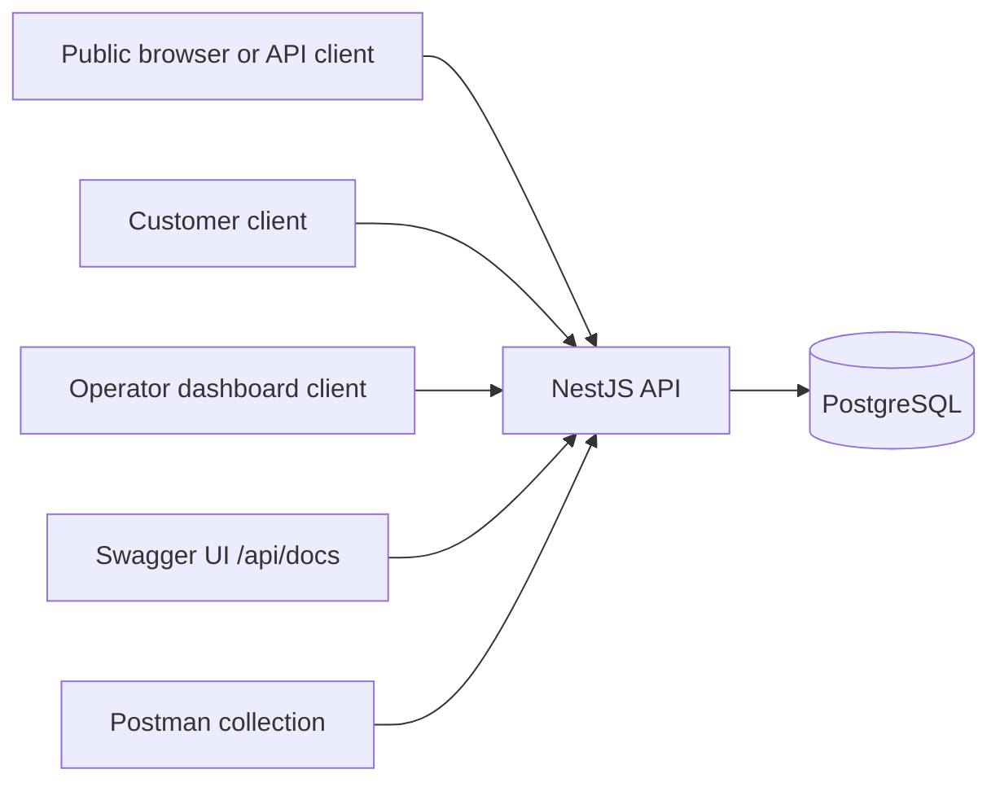
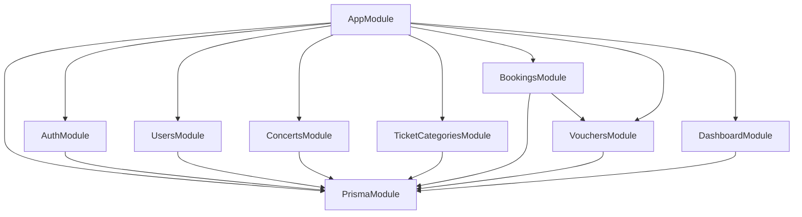
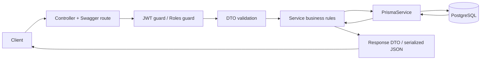

# Architecture

## System Context

The backend is a modular NestJS API backed by PostgreSQL. Swagger and Postman are developer-facing interfaces. PostgreSQL stores users, concerts, ticket categories, bookings, voucher usage, and operational data.

## Application Layers

- Controllers define HTTP routes, Swagger metadata, authentication/authorization guards, and request/response boundaries.
- DTOs define validation rules using `class-validator` and Swagger schemas.
- Guards and decorators enforce JWT authentication and role checks through `JwtAuthGuard`, `RolesGuard`, `@CurrentUser`, and `@Roles`.
- Services contain business rules, transaction boundaries, Prisma queries, and response serialization.
- `PrismaService` extends the generated Prisma 7 client and configures `@prisma/adapter-pg`.
- PostgreSQL enforces persistence, uniqueness, foreign keys, indexes, and atomic row updates.

## Module Structure

- `AuthModule`: registration, login, refresh rotation, logout.
- `UsersModule`: current-user response and operator user listing.
- `ConcertsModule`: operator concert management and public concert browsing.
- `TicketCategoriesModule`: operator category management scoped to concerts.
- `BookingsModule`: customer booking workflow plus operator booking monitoring/status transitions.
- `VouchersModule`: operator voucher CRUD and customer validation preview.
- `DashboardModule`: operator summary metrics.
- `PrismaModule`: global Prisma client provider.

## Authentication and Authorization

Customers register through `POST /auth/register`; public registration does not accept a role and creates `CUSTOMER`. Login verifies bcrypt password hashes, then issues access and refresh JWTs. Refresh tokens are hashed before storage and rotated on every refresh. Logout clears the stored refresh-token hash.

Protected endpoints use `JwtAuthGuard`. Role-restricted endpoints also use `RolesGuard`. Missing or invalid tokens return `401`; authenticated users without the required role return `403`.

## Data and Transaction Boundaries

Transactions are used for workflows that must commit or roll back as a single unit:

- Booking creation validates concert/category state, reserves ticket inventory, optionally consumes voucher usage, creates the booking, creates booking items, and creates `VoucherUsage`.
- Failed payment and cancellation transition a booking to `CANCELLED`, restore ticket stock, and release voucher usage.
- Operator status transitions reuse the same booking transition side effects.

Booking responses use stored monetary and voucher snapshots. They do not recalculate from current ticket category or voucher records.

## Concurrency Strategy

- Ticket overselling is prevented with conditional `updateMany` on `TicketCategory.sold`, requiring enough remaining quantity at update time.
- Booking payment/cancellation uses conditional `updateMany` from `PENDING`; duplicate or racing transitions affect zero rows and return `409`.
- Voucher global limits use a parameterized SQL update with `usedCount < usageLimit` checked in the database.
- Voucher per-user usage uses unique `(voucherId, userId)` plus `INSERT ... ON CONFLICT ... DO UPDATE ... WHERE usedCount < limit`.
- Voucher release uses conditional `APPLIED -> RELEASED` updates and decrement guards (`usedCount > 0`) to prevent duplicate restoration and underflow.

The implementation relies on database atomicity and constraints rather than in-memory checks or background locks.

## Error Handling and Serialization

- Validation errors come from NestJS `ValidationPipe` with `whitelist`, `forbidNonWhitelisted`, and `transform`.
- Common status mappings: `400` invalid input, `401` unauthenticated, `403` wrong role/ownership, `404` missing resource, `409` business conflict or invalid state transition.
- Voucher CRUD maps Prisma unique and missing-record errors to HTTP exceptions.
- Decimal money values are serialized as strings.
- API response DTOs avoid exposing `passwordHash`, `refreshTokenHash`, and internal relation details unless intentionally part of an operator response.

## High-Level Request Flow

