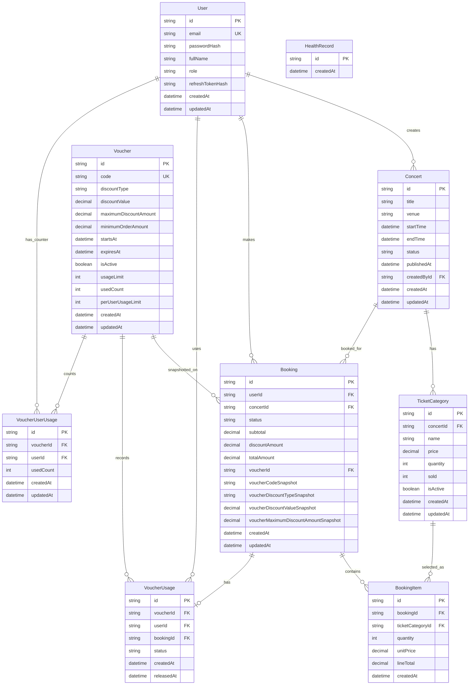

# Entity Relationship Diagram

## Notes

- Most business entities use UUID string IDs. `HealthRecord` uses `cuid()` and exists from the initial bootstrap phase.
- Money fields use PostgreSQL `Decimal(12,2)` through Prisma and are serialized as strings in API responses.
- `TicketCategory.sold` tracks reserved/paid tickets currently held by non-cancelled bookings.
- `BookingItem.unitPrice`, `BookingItem.lineTotal`, `Booking.subtotal`, `Booking.discountAmount`, and `Booking.totalAmount` are immutable booking-time snapshots.
- Voucher snapshots on `Booking` preserve code, discount type, discount value, and maximum discount at booking time.
- `Voucher.usedCount` is the number of active `APPLIED` voucher usages.
- `VoucherUserUsage.usedCount` is the active usage count for one user and voucher.
- `VoucherUsage.bookingId` is unique, so one booking can have at most one voucher usage record.
- `TicketCategory` is unique by `(concertId, name)`.
- `VoucherUserUsage` is unique by `(voucherId, userId)`.
- Concert deletion cascades to ticket categories, but booking relationships restrict deletion where history exists.
- Voucher, user, booking, and ticket-category history uses restrictive foreign keys where needed to preserve auditability.
