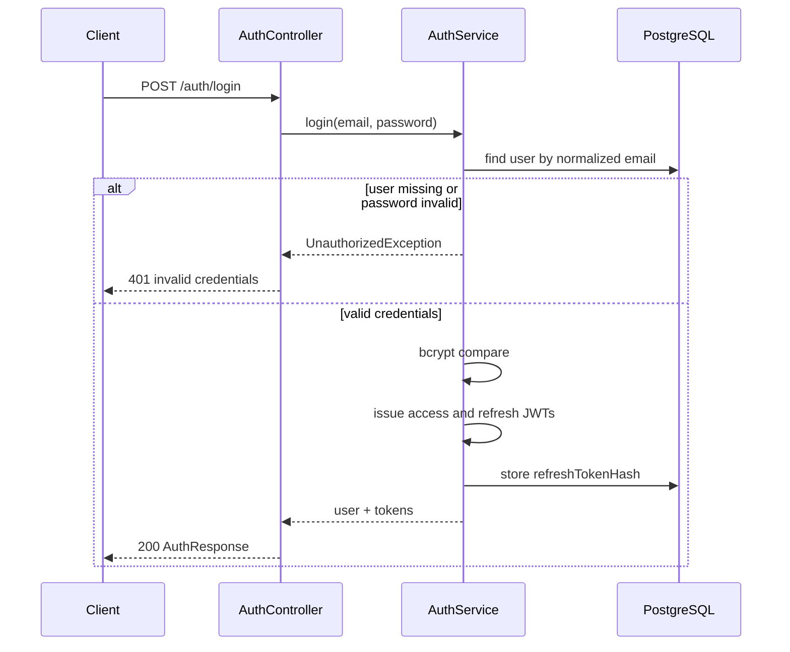
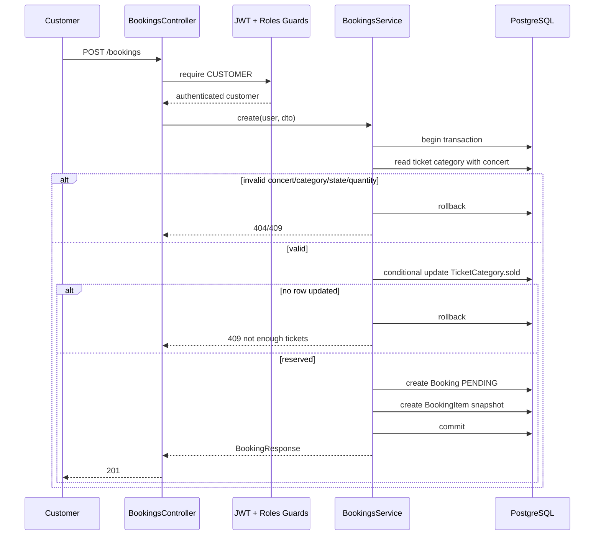
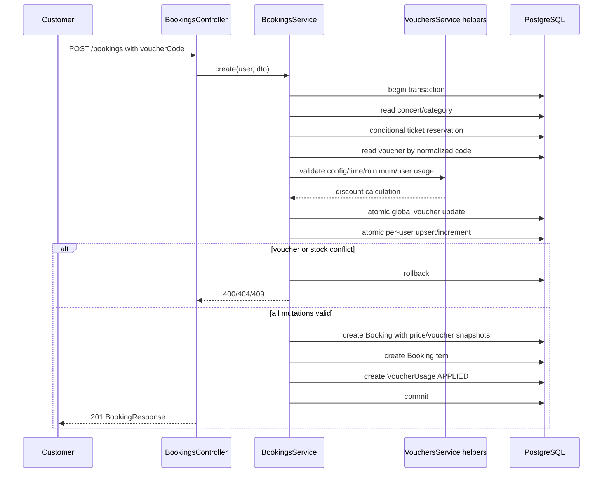
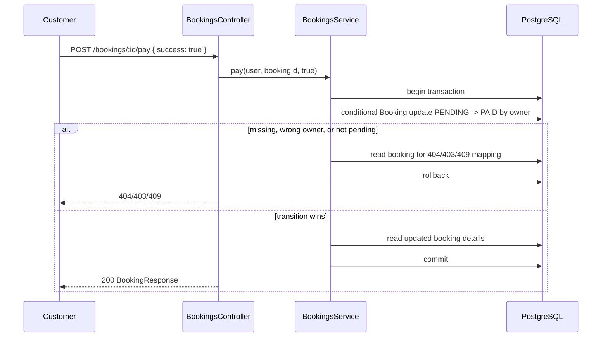
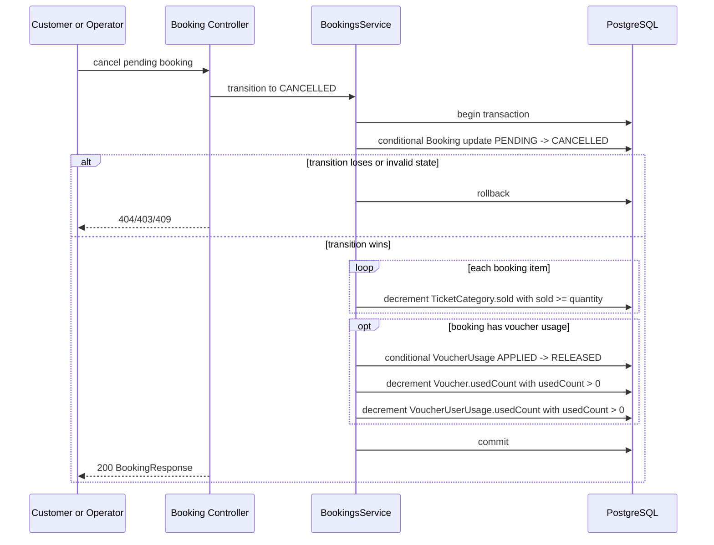
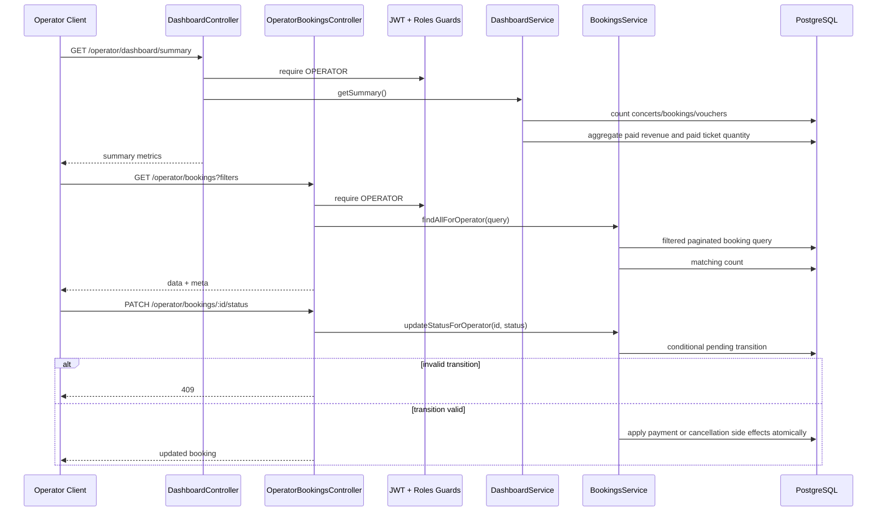

# Sequence Diagrams

## Customer Login

```mermaid
sequenceDiagram
  participant C as Client
  participant AC as AuthController
  participant AS as AuthService
  participant DB as PostgreSQL

  C->>AC: POST /auth/login
  AC->>AS: login(email, password)
  AS->>DB: find user by normalized email
  alt user missing or password invalid
    AS-->>AC: UnauthorizedException
    AC-->>C: 401 invalid credentials
  else valid credentials
    AS->>AS: bcrypt compare
    AS->>AS: issue access and refresh JWTs
    AS->>DB: store refreshTokenHash
    AS-->>AC: user + tokens
    AC-->>C: 200 AuthResponse
  end
```

## Create Booking Without Voucher

```mermaid
sequenceDiagram
  participant C as Customer
  participant BC as BookingsController
  participant Guard as JWT + Roles Guards
  participant BS as BookingsService
  participant DB as PostgreSQL

  C->>BC: POST /bookings
  BC->>Guard: require CUSTOMER
  Guard-->>BC: authenticated customer
  BC->>BS: create(user, dto)
  BS->>DB: begin transaction
  BS->>DB: read ticket category with concert
  alt invalid concert/category/state/quantity
    BS->>DB: rollback
    BS-->>BC: 404/409
  else valid
    BS->>DB: conditional update TicketCategory.sold
    alt no row updated
      BS->>DB: rollback
      BS-->>BC: 409 not enough tickets
    else reserved
      BS->>DB: create Booking PENDING
      BS->>DB: create BookingItem snapshot
      BS->>DB: commit
      BS-->>BC: BookingResponse
      BC-->>C: 201
    end
  end
```

## Create Booking With Voucher

```mermaid
sequenceDiagram
  participant C as Customer
  participant BC as BookingsController
  participant BS as BookingsService
  participant VS as VouchersService helpers
  participant DB as PostgreSQL

  C->>BC: POST /bookings with voucherCode
  BC->>BS: create(user, dto)
  BS->>DB: begin transaction
  BS->>DB: read concert/category
  BS->>DB: conditional ticket reservation
  BS->>DB: read voucher by normalized code
  BS->>VS: validate config/time/minimum/user usage
  VS-->>BS: discount calculation
  BS->>DB: atomic global voucher update
  BS->>DB: atomic per-user upsert/increment
  alt voucher or stock conflict
    BS->>DB: rollback
    BS-->>BC: 400/404/409
  else all mutations valid
    BS->>DB: create Booking with price/voucher snapshots
    BS->>DB: create BookingItem
    BS->>DB: create VoucherUsage APPLIED
    BS->>DB: commit
    BC-->>C: 201 BookingResponse
  end
```

## Pay Booking

```mermaid
sequenceDiagram
  participant C as Customer
  participant BC as BookingsController
  participant BS as BookingsService
  participant DB as PostgreSQL

  C->>BC: POST /bookings/:id/pay { success: true }
  BC->>BS: pay(user, bookingId, true)
  BS->>DB: begin transaction
  BS->>DB: conditional Booking update PENDING -> PAID by owner
  alt missing, wrong owner, or not pending
    BS->>DB: read booking for 404/403/409 mapping
    BS->>DB: rollback
    BC-->>C: 404/403/409
  else transition wins
    BS->>DB: read updated booking details
    BS->>DB: commit
    BC-->>C: 200 BookingResponse
  end
```

## Cancel Booking

```mermaid
sequenceDiagram
  participant C as Customer or Operator
  participant API as Booking Controller
  participant BS as BookingsService
  participant DB as PostgreSQL

  C->>API: cancel pending booking
  API->>BS: transition to CANCELLED
  BS->>DB: begin transaction
  BS->>DB: conditional Booking update PENDING -> CANCELLED
  alt transition loses or invalid state
    BS->>DB: rollback
    API-->>C: 404/403/409
  else transition wins
    loop each booking item
      BS->>DB: decrement TicketCategory.sold with sold >= quantity
    end
    opt booking has voucher usage
      BS->>DB: conditional VoucherUsage APPLIED -> RELEASED
      BS->>DB: decrement Voucher.usedCount with usedCount > 0
      BS->>DB: decrement VoucherUserUsage.usedCount with usedCount > 0
    end
    BS->>DB: commit
    API-->>C: 200 BookingResponse
  end
```

## Operator Monitoring

```mermaid
sequenceDiagram
  participant O as Operator Client
  participant DC as DashboardController
  participant OC as OperatorBookingsController
  participant Guard as JWT + Roles Guards
  participant DS as DashboardService
  participant BS as BookingsService
  participant DB as PostgreSQL

  O->>DC: GET /operator/dashboard/summary
  DC->>Guard: require OPERATOR
  DC->>DS: getSummary()
  DS->>DB: count concerts/bookings/vouchers
  DS->>DB: aggregate paid revenue and paid ticket quantity
  DC-->>O: summary metrics

  O->>OC: GET /operator/bookings?filters
  OC->>Guard: require OPERATOR
  OC->>BS: findAllForOperator(query)
  BS->>DB: filtered paginated booking query
  BS->>DB: matching count
  OC-->>O: data + meta

  O->>OC: PATCH /operator/bookings/:id/status
  OC->>BS: updateStatusForOperator(id, status)
  BS->>DB: conditional pending transition
  alt invalid transition
    OC-->>O: 409
  else transition valid
    BS->>DB: apply payment or cancellation side effects atomically
    OC-->>O: updated booking
  end
```
